# 复现

## 运行程序

分别输入假码获取三个验证文件

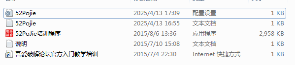

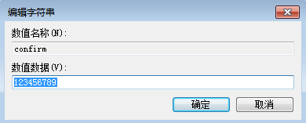

## 1

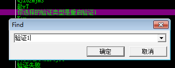

利用插件查询关键词，定位验证1的位置，然后在这一模块入口打断点

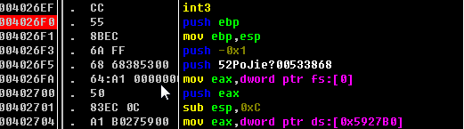

启动程序让程序运行到断点处，然后开始调试，直到进入0x0040275B处的call

发现此处使用了获取输入框输入函数，程序应该是在此处读取我们输入的注册码，返回长度，判断是否为空

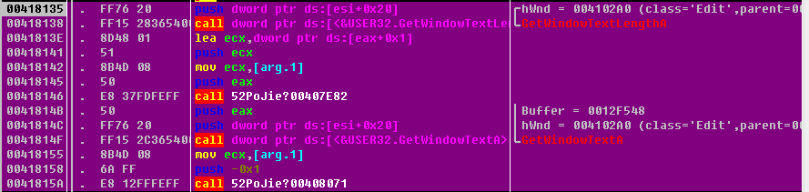

继续过代码，此处是创建txt文件，然后验证是否成功创建

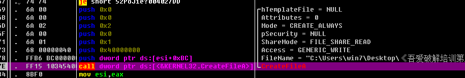

写入文件退出程序

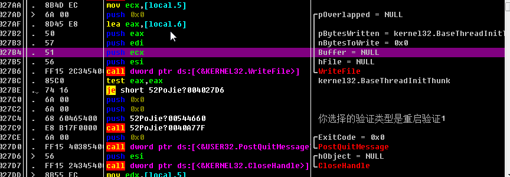

接下来寻找验证文件52Pojie.txt
直接搜索字符串定位

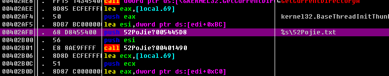

继续过代码，此处是确认文件是否存在

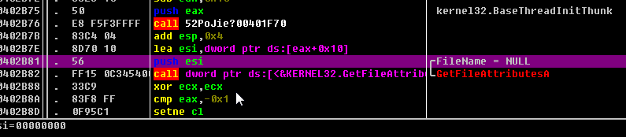

在下方找到的验证通过字符串，这上面的call很可能是验证注册码是否有效的，如果无效可能会利用je直接跳走

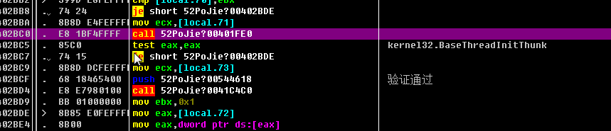

实际上直接把je改为nop可能就可以跳过验证
进入call以后过代码能找到这个注册码

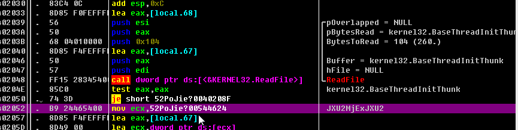

输入这个注册码重启发现验证1已经成功了

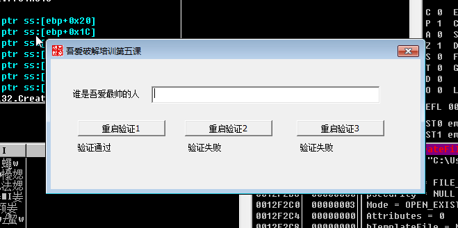

## 2

同样的办法，找到创建ini的函数附近，找到验证通过的字符串，在上方的call处步入

持续步进找到ini的字符串

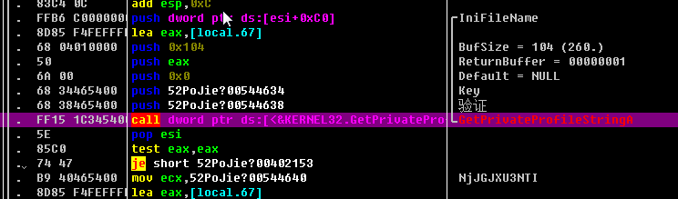

验证2通过了

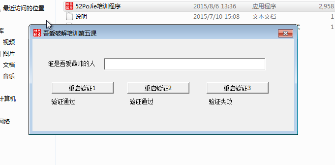

## 3

非常有趣的事情是在寻找验证2的key时发现其实三个验证使用的是同一个函数，所以我直接向下找到了注册表的key

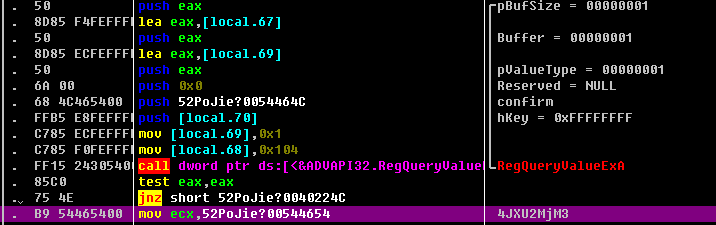

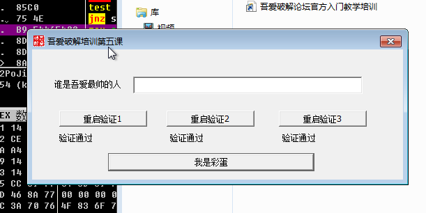